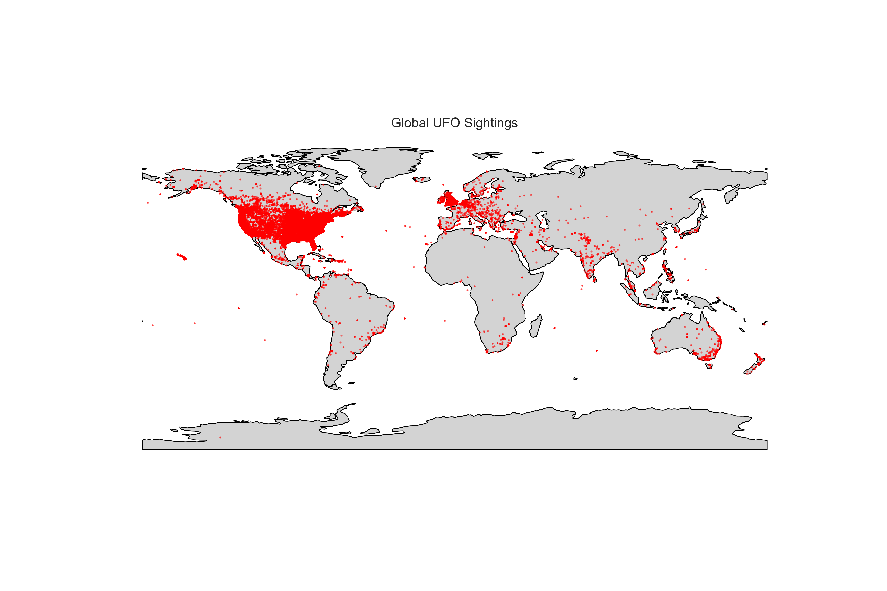
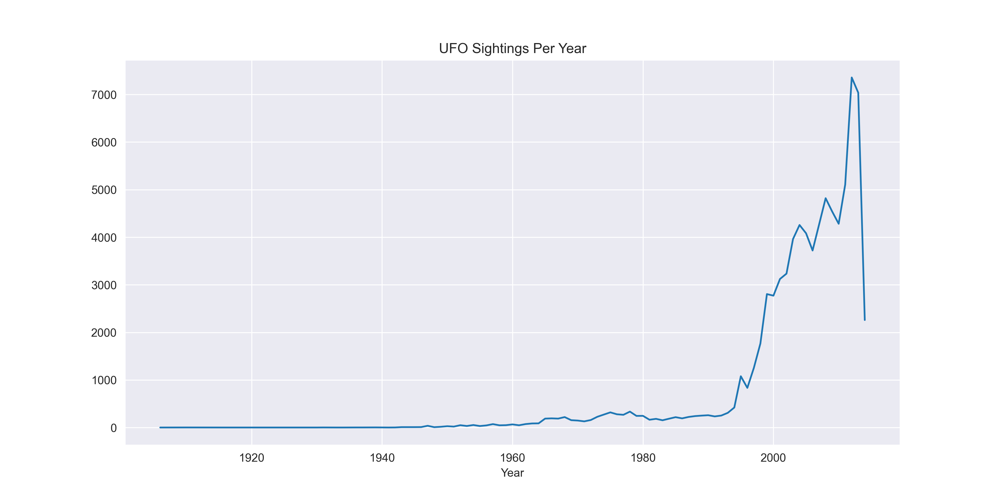
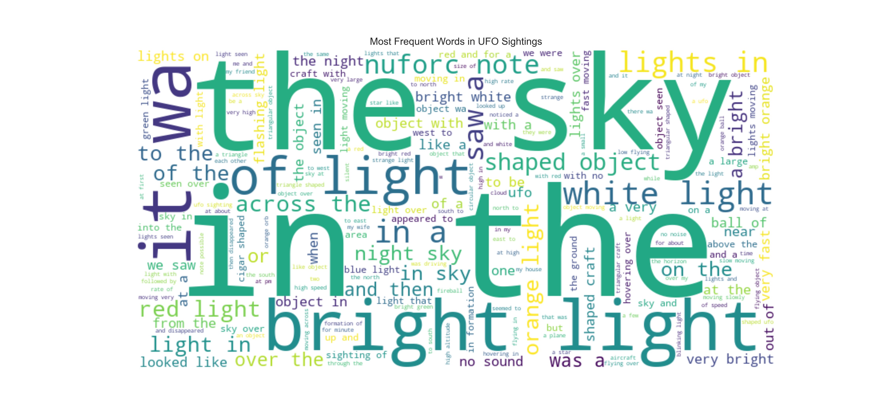

---

## 📊 Exploratory Data Analysis

- Cleaned and standardized city, state, country, and time fields.
- Explored frequency of shapes, durations, and reporting trends.
- Chi-square test & Cramér’s V used to assess shape correlations by location.

---

## 🗺️ Geospatial Analysis

Using GeoPandas, sightings were plotted on a global basemap to explore density by region.

---

## 🕒 Temporal Trends

Analyzed yearly, monthly, weekday, and hourly sighting patterns.

- Most sightings occur in **summer**, especially **July**.
- Reports spike between **8 PM and midnight**.
- Sightings peaked around **1997–2003**.

---

## 💬 Natural Language Processing (NLP)

Applied text cleaning, sentiment analysis, and word cloud generation on over 80,000 sighting descriptions.

- Majority of reports are **neutral or mildly positive**.
- Language tends to be **objective**, focusing on observation.
- Word cloud of most common terms below:

---

## 📌 Tools Used

- Python (Pandas, NumPy, Matplotlib, Seaborn, GeoPandas)
- NLP: `TextBlob`, `wordcloud`, `nltk`
- Geospatial: `geopandas`, `shapely`, `geodatasets`
- Jupyter Notebooks

---

## 🚀 Possible Future Work

- Topic modeling on sighting descriptions
- Time-series forecasting or anomaly detection
- Interactive dashboard (e.g., with Plotly Dash or Streamlit)

---

## 📄 License

MIT

---

## 🤝 Acknowledgments

Data from [NUFORC](https://www.kaggle.com/datasets/NUFORC/ufo-sightings) via Kaggle.
